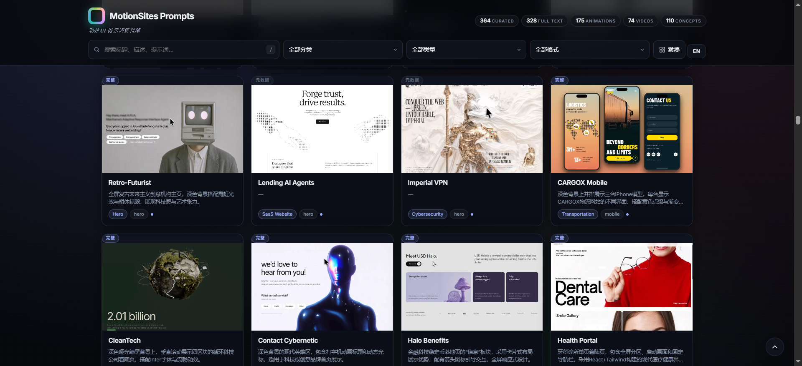
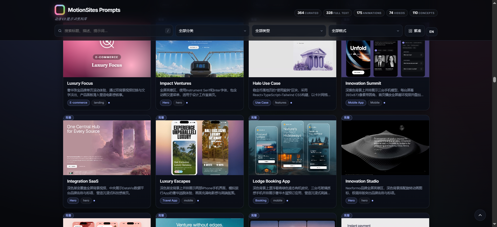
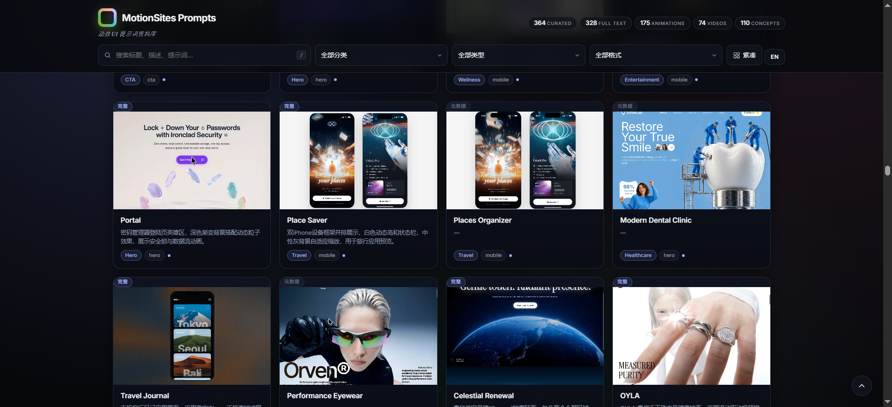
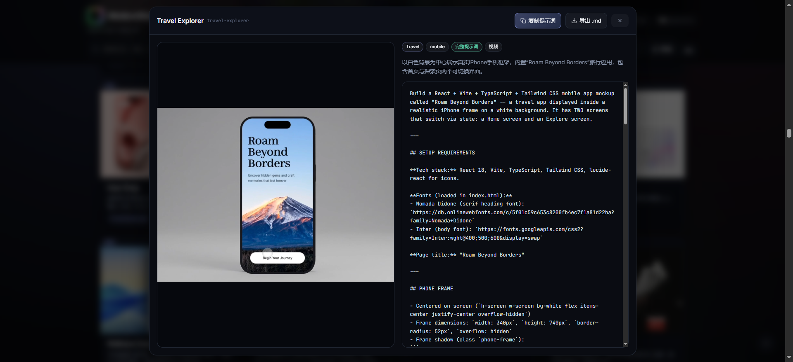
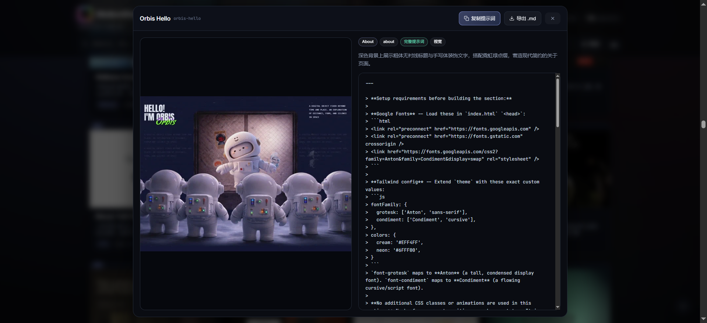

# MotionSites Prompts — A Curated Library of Motion-Driven UI

> 中文一个精选的、面向动效驱动 UI 的提示词(Prompt)合集。
>
> An offline-first, single-file catalog of **motion-driven UI prompts** — landing pages, hero scenes, agency showcases, dashboards, and more.

---

## 中文简介

**MotionSites Prompts** 是一个开源、离线优先的动效 UI 提示词目录，汇集 300+ 条动效驱动型 UI 提示词，涵盖着陆页、Hero 首屏、SaaS、作品集、看板、行业模板等。

每条提示词可一键复制、导出为 Markdown；部分配有本地化预览 (WebP / MP4)。全部是单文件静态页，无登录、无联网、无付费墙。

### 你能用它做什么

- 复制提示词 → 任何 LLM (ChatGPT / Claude / Gemini / DeepSeek)，快速生成前端代码
- 作为动效设计灵感库
- 本地多维筛选：分类、类型、是否付费、媒体格式
- 作为团队 / 个人作品集的起始模板

### 真实运行截图

以下 5 张截图是真实的 MotionSites Prompts 站点界面：

| 视图 | 说明 |
| --- | --- |
|  | 主页 Hero + 筛选器 + 首屏卡片：Retro-Futurist / Lending AI Agents / Imperial VPN / CARGOX Mobile / CleanTech / Contact Cybernetic / Halo Benefits / Health Portal |
|  | 第二屏：Luxury Focus / Impact Ventures / Halo Use Case / Innovation Summit / Integration SaaS / Luxury Escapes / Lodge Booking App / Innovation Studio |
|  | 第三屏：Portal / Place Saver / Places Organizer / Modern Dental Clinic / Travel Journal / Performance Eyewear / Celestial Renewal / OYLA |
|  | 详情弹窗：左侧是 Travel Explorer 的手机模型预览，右侧是完整的提示词正文 (React + Vite + TypeScript + Tailwind) |
|  | 详情弹窗：左侧是 Orbis Hello 的 3D 宇航员机器人预览，右侧是完整的提示词正文 |

### 仓库内容速览

`
MotionSites-Prompts/
├── README.md           # 本文件 (中英双语)
├── LICENSE             # MIT
├── CONTRIBUTING.md     # 贡献指南
├── CHANGELOG.md        # 更新日志
├── prompts/            # 分类提示词库
│   ├── _TEMPLATE.md
│   ├── landing/      # 着陆页
│   ├── hero/         # Hero
│   ├── saas/         # SaaS
│   ├── agency/       # 作品集
│   ├── dashboard/    # 看板
│   └── portfolio/    # 作品集个人
├── templates/          # HTML 模板
├── examples/           # 完整示例
├── docs/
│   ├── user-screenshots/  # 真实截图 (5 张)
│   ├── screenshots/       # SVG 示意图
│   ├── preview-png/       # 渲染快照
│   └── catalog.json       # 提示词索引
├── scripts/            # 校验 + 渲染
└── index.html
`

### 如何使用

#### 1. 直接在 GitHub 上浏览

打开任一个 prompts/<category>/*.md，复制其中的 Prompt 代码块即可使用。

#### 2. 本地浏览

`ash
git clone https://github.com/zhaosenlin12-creator/MotionSites-Prompts.git
cd MotionSites-Prompts
# 直接打开
start index.html         # Windows
open index.html          # macOS
xdg-open index.html      # Linux
# 或启动静态服务器
python -m http.server 8000
# 访问 http://localhost:8000
`

### 贡献方式

请参考 [CONTRIBUTING.md](CONTRIBUTING.md)：

1. 复制 prompts/_TEMPLATE.md 到 prompts/<category>/NNN-name.md
2. 在 docs/catalog.json 追加索引
3. 运行 python scripts/validate_catalog.py 验证
4. 提交 PR

### 数据来源与版权

| 字段 | 来源 |
| --- | --- |
| 标题、描述、分类、媒体链接 | 公开的 [motionsites.ai](https://motionsites.ai) |
| 完整提示词正文 | 社区维护的开源仓库 |
| 预览素材 | motionsites.ai CDN |

每条提示词的版权归原作者所有，本仓库仅做归档与索引。

---

## English

**MotionSites Prompts** is an open-source, offline-first catalog of **motion-driven UI prompts** with **300+ curated prompts** across landing pages, hero scenes, SaaS sections, agency showcases, dashboards, and industry-specific templates (travel, healthcare, real estate).

### Highlights

- ✅ Single static file — open index.html directly, no build step
- U0001F50D Multi-dimensional filters — category, type, access, media format
- ⌨️ Keyboard-first — /, Esc, G shortcuts
- U0001F3A8 Two card densities — standard 16:10 grid and compact
- U0001F30C Spotlight search — best-match glow
- U0001F4E6 Offline — no network calls after clone

### File layout

`
.
├── README.md
├── LICENSE
├── CONTRIBUTING.md
├── CHANGELOG.md
├── prompts/  (landing / hero / saas / agency / dashboard / portfolio)
├── templates/
├── examples/
├── docs/user-screenshots/   # real running screenshots
├── docs/screenshots/        # SVG mockups
├── docs/preview-png/        # rendered PNGs
├── docs/catalog.json        # machine-readable index
└── scripts/
`

### Usage

1. **Browse on GitHub** — open any file under prompts/<category>/.
2. **Local browsing** — git clone then double-click index.html or serve with python -m http.server.
3. **Pipeline integration** — docs/catalog.json is machine-readable.

### Contributing

See [CONTRIBUTING.md](CONTRIBUTING.md). New prompts should follow the format in prompts/_TEMPLATE.md, be appended to docs/catalog.json, and pass python scripts/validate_catalog.py.

### License

[MIT](LICENSE) — free to use, modify, and redistribute. Individual prompt bodies retain their original authors copyrights.

---

## Roadmap

- [x] Bilingual README
- [x] Categorized prompts library
- [x] Real running screenshots (docs/user-screenshots/)
- [x] SVG mockups (docs/screenshots/)
- [x] Machine-readable docs/catalog.json
- [x] Validator script (scripts/validate_catalog.py)
- [ ] Live single-file viewer (index.html)
- [ ] CI: schema validation on push
- [ ] Bilingual translations for every prompt (zh-CN / en-US)