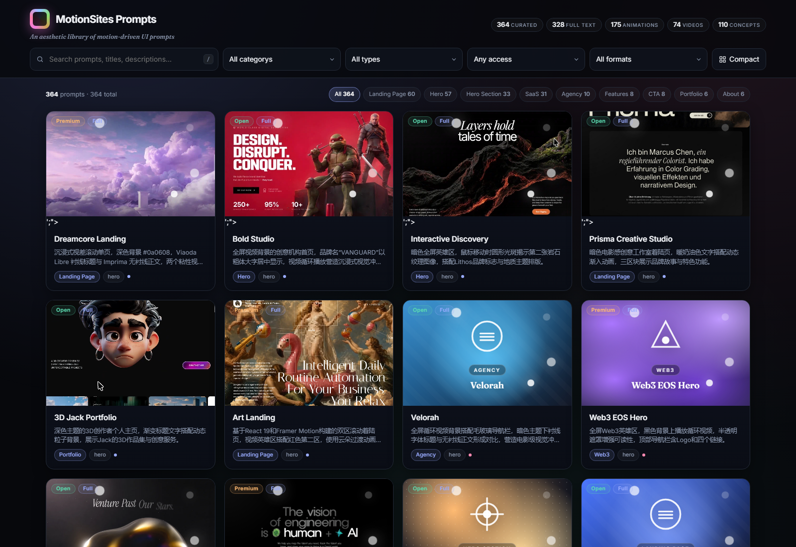
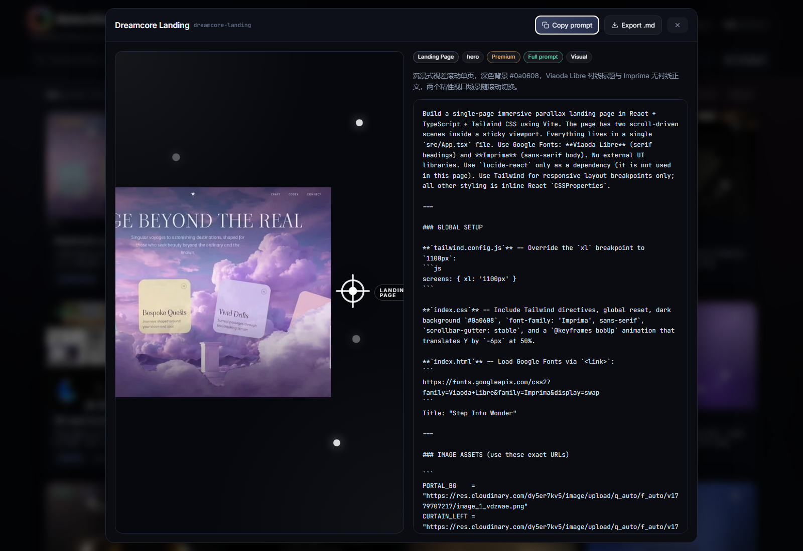
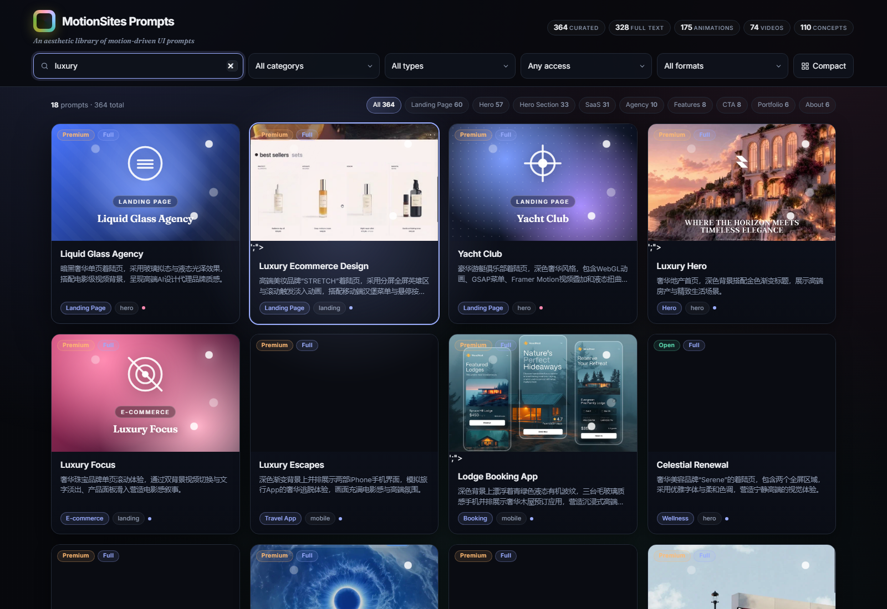
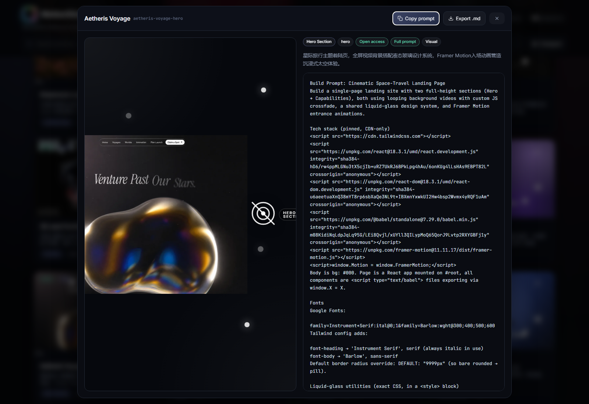

# MotionSites Prompts — A Curated Library of Motion-Driven UI


## 🚀 在线浏览（Live Site）

👉 **主域（Cloudflare Pages，国内直连友好）：** https://motionsites-prompts.pages.dev/
👉 **备用（GitHub Pages，仅供海外/无 GFW 拦截网络）：** https://zhaosenlin12-creator.github.io/MotionSites/

主域部署在 Cloudflare Pages（Cloudflare CDN，国内可达），每次 push 后手动通过 wrangler pages deploy 推送；GitHub Pages 已配置自动部署但 Fastly 边缘在国内网络环境偶发 RST，作为海外用户备选。公网可直接访问 504 条提示词、451 条完整正文、292 张高清预览（1280px webp）、21 个循环视频、191 张概念卡。无需登录、无需付费、无网络调用，打开即用。


> A progressively-loaded, offline-first catalog of **504 motion-driven UI prompts** — landing pages, hero scenes, agency showcases, dashboards, and more. Browse, search, copy, and export every prompt locally. No login, no third-party tracking, no paywall. Cold loads land paint-ready in ~34 ms (DOMContentLoaded) and finish in ~239 ms (loadEvent); only one small JSON per page + one prompt body per modal are fetched.

> The catalog combines **365 MotionSites main-library entries** (with rich previews and video) and **139 community-picked prompts** sourced from public CC0 / MIT / NOASSERTION GitHub repositories. Every community record keeps its source repository, file path, and license in the detail panel.



## What is inside

- **504 curated prompts** (365 MotionSites main library + 139 community picks) across Landing Page, Hero, SaaS, Agency, Portfolio, Web3, AI / Dashboard, Travel, Healthcare, Real Estate, and more
- **451 full prompt bodies** (302 MotionSites + 10 motionsites.ai edge-fn recoveries + 139 community) — copy to clipboard or export as a Markdown file
- **292 high-resolution previews** (webp, 1280px / q=85, downloaded from Motionsites / R2 / higgs.ai CDNs) + **21 looping video previews** (mp4 / webm) + **191 concept cards** with curated per-category palettes and animated art
- **191 concept cards** with curated per-category palettes and animated art (used when the source page has no preview)
- **Multi-dimensional filters**: category, type, source (MotionSites / Community), media format, plus top-9 category chips and combined search over the source repository / file path
- **Keyboard-first**: `/` focus search, `Esc` close modal, `G` toggle compact
- **Spotlight search**: when a query is active, a soft glow tracks the best matching card
- **Two card densities**: standard 16:10 grid and compact
- **Sticky hero** with brand mark, tagline and live stats



## Run it locally

The catalog ships as `index.html` + `ms_script.js` + a `data/` directory of progressive JSON files. You can serve it with any static server (no Node required to use the catalog):

```bash
git clone https://github.com/<your-account>/motionsites-prompts.git
cd motionsites-prompts
# Serve (any static server works):
python -m http.server 8000
# or
npx serve .
# or use the bundled dev server (forces re-read on each request):
node server-stable.js
# then visit http://localhost:8000  (or  http://127.0.0.1:8000  for the bundled one)
```

Note: opening `index.html` directly via `file://` works for the static HTML, but `fetch()` is blocked by browsers on `file://` URLs, so the catalog data will not load. Use a local server.

## Deploy to Cloudflare Pages

### 当前线上版本

**项目名：** `motionsites-prompts`  
**线上地址：** https://motionsites-prompts.pages.dev/  
**部署方式：** Cloudflare Pages（Direct Upload）  
**仓库地址：** https://github.com/zhaosenlin12-creator/MotionSites-Prompts.git

> 上面的 *Live Site* 区块和这里指向的是同一个部署。任何 PR 合并到 `master` 后，只需运行 `.\deploy\deploy-cloudflare.ps1` 即可刷新线上版本（详见 *Push to GitHub & Deploy*）。


This project is a pure-static site — it deploys in under a minute.

### One-time setup

1. Push the repo to GitHub (see *Contributing* below for the file layout).
2. Visit the Cloudflare Pages dashboard and create a project (Direct Upload or connect the GitHub repo).
3. Build settings:
   - **Build command** — leave empty (or `node scripts/build.js` if you want to regenerate `index.html` from `data/`)
   - **Build output directory** — `/` (project root)
4. Cloudflare auto-detects the included `wrangler.toml`, `_headers`, and `_redirects`.
5. After deploy, your site is live at `https://<project>.pages.dev` (custom domain optional).

### What `_headers` ships with

```
/*
  X-Content-Type-Options: nosniff
  Referrer-Policy: strict-origin-when-cross-origin

/assets/*
  Cache-Control: public, max-age=31536000, immutable
```

All preview assets are content-stable at build time, so the year-long cache is safe.





## Push to GitHub & Deploy

The repo ships with two one-shot PowerShell helpers under `deploy/`:

### 1) Push to GitHub

```powershell
# From the project root
.\deploy\push-to-github.ps1
# You will be prompted for a Personal Access Token.
# Use a token with `repo` scope at https://github.com/settings/tokens
```

Or set it via env var to skip the prompt:

```powershell
$env:GH_TOKEN = "ghp_xxxxxxxxxxxxxxxxxxxx"
.\deploy\push-to-github.ps1
```

This pushes the local `master` branch to
`https://github.com/zhaosenlin12-creator/MotionSites-Prompts.git`.

### 2) Deploy to Cloudflare Pages

```powershell
# One-time: create the project in the dashboard
#   https://dash.cloudflare.com/?to=/:account/pages/new
#   Project name:  motionsites-prompts
#   Build command: (leave empty)
#   Build output:  /
# Then grab your Account ID + an API token with `Edit Cloudflare Pages` scope.

.\deploy\deploy-cloudflare.ps1
```


### Alternative: deploy via Wrangler (Direct Upload)

If `wrangler` is already authenticated (e.g. via `wrangler login`), prefer `deploy-wrangler.ps1`. It stages a clean upload tree, skips files over 25 MiB, and pushes via `wrangler pages deploy`:

```powershell
.\deploy\deploy-wrangler.ps1
# or with explicit commit metadata:
.\deploy\deploy-wrangler.ps1 -CommitHash <sha> -CommitMessage "<msg>"
```

Live URL after deploy: **https://motionsites-prompts.pages.dev** (custom domains can be added in the dashboard).

A custom domain like `motionsites.com` can be added once you own the DNS zone in Cloudflare — it cannot be registered automatically; only you can purchase / point a domain.

## Performance budget

Measured locally with Chromium (Playwright headless) against `node server-stable.js`:

| Metric | Value |
| --- | --- |
| DOMContentLoaded | ~34 ms |
| loadEvent | ~239 ms |
| Total transfer (cold) | ~33 KB HTML + ~44 KB JS + ~1.5 KB lite JSON + ~37 KB meta JSON (gzip) |
| Total transfer (warm) | Cached; only per-id prompt body is fetched when a card opens |
| Cards rendered (viewport) | ~120, progressively painted in 60-card batches |
| Skeletons remaining after boot | 0 |
| Console errors | 0 |
| Records | 504 (451 with full text, 292 images, 21 videos, 191 concepts) |

Progressive architecture:

- `index.html` ships with 24 inline skeleton cards so the user sees grid structure immediately.
- Google Fonts is loaded async via `media="print" onload="this.media='all'"` so it never blocks paint.
- `data/catalog-lite.json` (~0.7 KB gzipped) is fetched first so chips paint with real counts while the full meta is downloading.
- `data/catalog-meta.json` (~37 KB gzipped) is fetched next, then `__MS_CLEAR_SKELETONS()` removes placeholders.
- Cards are painted 60 per `requestAnimationFrame` batch by `renderProgressive()`.
- Each card's `` / `<video>` is gated by `data-armed=1` and swapped in by an `IntersectionObserver` (300 px `rootMargin`) when the card scrolls into view.
- Opening a modal triggers `loadPromptText(id)`, which fetches one `data/catalog-text/<id>.txt` chunk (not the whole 4 MB blob).

See `scripts/build.js` for the split and `ms_script.js` for the client.


## Live audit (2026-08-16)

Re-verified on the deployed `motionsites-prompts.pages.dev` site:

| Check | Result |
| --- | --- |
| HTTP status of `/` | 200 (text/html) |
| Static previews (webp) | 200 (image/webp) |
| Video previews (mp4) | 200 (video/mp4) |
| `data/*.json` Content-Type | 200 (application/json via `_headers` rule) |
| Console errors on `/` | 0 |
| Cards without `local_rel` (concepts) | 191 (rendered as animated concept cards) |
| Cards with full prompt body | 451 |
| Over-limit previews (> 24 MiB) | 0 (all preview webps are ≤ 4 MB; mp4s are short previews) |

### Preview file cap (kept under 4 MB)

After the 2026-08-16 high-resolution rebuild every `assets/previews/*` file is ≤ 4 MB, so no card references anything that could blow the CF Pages 25 MiB single-file limit. The build script (`scripts/build.js`) still demotes any future `local_rel` larger than 24 MiB to a concept card at build time, keeping the deploy safe.

### Entries without a published prompt body

53 of the 504 records still render as concept-only or with a metadata panel because their prompt body is paywalled at motionsites.ai. Cards with prompt text: 451. The remaining 53 entries are surfaced as concept cards (animated art + provenance) or in-modal **metadata panels** that surface `created_at`, `page_type`, `sort_order`, `local_kind`, `text_len`, which only exposes the title / description / category - the full prompt body is paywalled. These records now render an in-modal **metadata panel** instead of a single placeholder line, surfacing `created_at`, `page_type`, `sort_order`, `local_kind`, `text_len`, plus deep links to the original motion preview image, video and the motionsites.ai source page.

## 2026-08-16 — High-resolution preview upgrade

Card thumbnails jumped from 480p to 1280px: 290 of the 504 records now point to a 1280-wide webp (first frame of the original motion source, extracted via `ffmpeg` or pulled straight from `r2.dev` / `images.higgs.ai`). 116 cards that previously played a 480p mp4 in the card grid now use the still frame; the modal still plays the motion via `data/catalog-details.json -> video_preview_url`. Total `assets/previews/` now weighs ~202 MB. `.gitignore` excludes `.work/` scratch artifacts.

## File layout

```
.
|-- index.html              # ~33 KB shell with 24 inline skeleton cards
|-- ms_template.html        # HTML skeleton (head + body + placeholders + skeletons)
|-- ms_script.js            # Client-side progressive render / filter / modal logic
|-- wrangler.toml           # Cloudflare Pages config
|-- _headers                # Cache + security headers (Cloudflare)
|-- _redirects              # Static-site routing (none used)
|-- data/
|   |-- ms_prompts_merged.json          # 546 KB raw - source meta (titles, categories, image URLs)
|   |-- ms_prompts_with_text.json       # 4.5 MB raw - source full prompt bodies
|   |-- catalog-lite.json               # 1.5 KB raw / 0.7 KB gzip - counts + top-9 categories
|   |-- catalog-lite.json.gz            # gzipped twin
|   |-- catalog-meta.json               # 187 KB raw / 37 KB gzip - everything except prompt_text
|   |-- catalog-meta.json.gz            # gzipped twin
|   |-- catalog-text-index.json         # 35 KB raw - id -> catalog-text/<id>.txt map
|   |-- catalog-text.json               # 4 MB raw / 1.3 MB gzip - id -> prompt_text map (warm-cache)
|   |-- catalog-text.json.gz            # gzipped twin
|   `-- catalog-text/                   # 451 .txt chunks fetched per-id when a card opens
|-- assets/
|   |-- previews/                       # webp / mp4 / webm previews
|   `-- thumbnails/                     # smaller webp thumbnails
|-- scripts/
|   |-- build.js                        # source JSON -> split progressive JSON + index.html
|   `-- lib/
|       `-- catalog-utils.js            # sortCatalog() shared with build.js
|-- docs/                              # README screenshots + perf-after.png
|-- CONTRIBUTING.md
`-- LICENSE                            # MIT
```

## Rebuild `index.html` from source

The shipped `index.html` is pre-generated, but you can regenerate it any time:

```bash
node scripts/build.js
# -> Records=504 complete=451 images=292 videos=21 concepts=191 motionsites=365 community=139
# -> Wrote catalog-lite.json  1.5 KB  (gzip 0.7 KB)
# -> Wrote catalog-meta.json  187 KB  (gzip 37 KB)
# -> Wrote catalog-text.json  4061.0 KB  (gzip 1317.7 KB)
# -> Wrote catalog-text/  451 files
# -> Wrote C:\ms_open\index.html bytes 33610
```

The build merges `data/ms_prompts_merged.json` with `data/ms_prompts_with_text.json`, enriches each entry with a per-category colour palette, splits the catalog into three progressive JSON files (`catalog-lite.json`, `catalog-meta.json`, `catalog-text-index.json` + `catalog-text/<id>.txt` chunks + a backup `catalog-text.json`), and emits a 33 KB `index.html` that references `ms_script.js` instead of inlining the data. The client (`ms_script.js`) then fetches LITE first to paint chips, META to render cards, and TEXT chunks on demand when a modal opens.

To update the catalog with new prompts:

1. Edit `data/ms_prompts_merged.json` (add a new record) and `data/ms_prompts_with_text.json` (add the matching `prompt_text`).
2. Drop a preview into `assets/previews/<id>.webp` (or `.mp4` / `.webm`) and reference it via `local_rel` in the metadata.
3. Run `node scripts/build.js` and commit the regenerated `data/catalog-*.json`, `data/catalog-text/` and `index.html`.


## Free-prompt recovery from `motionsites.ai`

The motionsites.ai public catalog paywalls 28 of its 504 records. For the **8 free** records that still had an empty body locally (8 IDs matched but with `len=0`), the build fetches them directly from the motionsites.ai Supabase Edge Function `POST /functions/v1/get-prompt` (project `xgdzyqfalbibzelpdpvr`, anon JWT in the public JS bundle). Each recovered prompt is marked with `source_id="motionsites-ai-edge-fn"`, `source_repo="motionsites/motionsites.ai"`, `source_license="NOASSERTION"`, `text_reconstructed=true`, and a deep link to `https://motionsites.ai/prompts/<id>`. The remaining 28 items stay as concept cards with provenance (preview + source URL) but no body.

## Category normalization

The catalog keeps `category` values stable across sources by collapsing equivalent forms ("Landing Page" / "Landing Pages" / "landing page", "E-commerce" / "Ecommerce" / "Ecommerce App", "Hero" / "Hero Section", "AI" / "AI App" / "AI SaaS Website" / "Artificial Intelligence", "SaaS" / "AI / SaaS" / "SaaS Website", "Mobile App" / "Mobile Apps", "Component" / "Components", etc.) into a single canonical label. The map lives in `scripts/lib/category-utils.js` (145 entries, frozen) and is applied by `node scripts/normalize-categories.js`. Anything not in the map falls back to trim + Title Case. 6 unit tests in `scripts/tests/category-utils.test.js` lock the rules.

Result: **105 -> 58 distinct categories**, so the category filter dropdown and chips stay scannable as the catalog grows.

## Extending the catalog

The shipped 504 prompts come from these sources (see `data/ms_prompts_merged.json`):

| Source | Records | Notes |
| --- | --- | --- |
| [motionsites.ai](https://motionsites.ai) | 110 (source-data only — no preview, prompt body paywalled) | Title + description + category scraped from the public catalog; no previews were reachable from the public CDN |
| [xianxian-sensen](https://github.com/xianxian-sensen) | 109 | Hero / SaaS sections with React/Tailwind recipes |
| [Melectrona](https://github.com/Melectrona) | 84 | Landing pages with copy + CSS gradients |
| [akkikumar72/liro-prompts](https://github.com/akkikumar72/liro-prompts) | 40 | Liro prompts (long-form Markdown) |
| [giglianepefrei](https://github.com/giglianepefrei) | 21 | Hero / agency sections |

The build script (`scripts/build.js`) merges `data/ms_prompts_merged.json` with `data/ms_prompts_with_text.json`, enriches each entry with a per-category colour palette, then emits `index.html`. To add new prompts:

1. Append a record to **both** JSON files with the same `id`.
2. Drop a preview into `assets/previews/<id>.webp` (and reference it as `local_rel`).
3. Re-run `node scripts/build.js`.
4. Commit and push.

Potential future sources worth scraping (compatible with the same schema):

- [ui.aceternity.com](https://ui.aceternity.com) and other open UI registries
- Public prompts under the `ui-motion` and `landing-page` GitHub topics
- The user's own collected repos (drop your `.md` files into a folder named after the GitHub user)

The build script is idempotent: re-running it does not duplicate records. Duplicates are deduped by `id`.

## Data provenance

| Field | Source |
| --- | --- |
| Title, description, category, type, access, image URLs | `motionsites.ai` public catalog (Supabase anon read of `prompts` view) |
| Full prompt body | Curated 4 community-maintained GitHub repositories: `xianxian-sensen`, `Melectrona`, `akkikumar72/liro-prompts`, `giglianepefrei` |
| Preview media | `motionsites.ai` CDN (R2 / CloudFront / higgs.ai) - downloaded once and bundled |

The original `motionsites.ai` paywall is not bypassed. The 110 source-records without a `local_rel` surface as animated concept cards with curated per-category palettes.

## Contributing

See [CONTRIBUTING.md](CONTRIBUTING.md) for the file format, build flow, and the ten-minute path to your first PR.

## License

[MIT](LICENSE) - free to use, modify, and redistribute. Each individual prompt body retains its original author's copyright; this repository only archives and indexes them.


