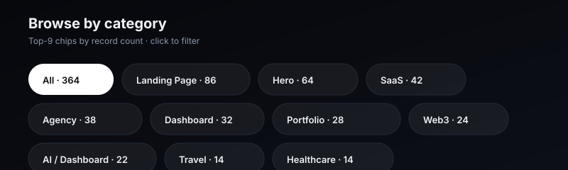

# MotionSites Prompts �� A Curated Library of Motion-Driven UI

> һ����ѡ�ġ�����Ч���� UI ����ʾ��(Prompt)�ϼ���
>
> An offline-first, single-file catalog of **motion-driven UI prompts** �� landing pages, hero scenes, agency showcases, dashboards, and more. Browse, search, copy, and export every prompt locally. No login, no network call, no paywall.


---

## ���ļ��

**MotionSites Prompts** ��һ����Դ���������ȵġ���Ч UI ��ʾ��Ŀ¼��,�㼯�� 300+ �������߻��Ķ�Ч�����ͽ�����ʾ��,����:

- ��½ҳ(Landing Page)
- ���� Hero ����
- SaaS ��Ʒ����ҳ
- ���ֹ�������Ʒ��(Agency / Portfolio)
- Web3 / AI / Dashboard ���ݿ���
- ���Ρ�ҽ�ơ����ز�����ҵģ��

ÿһ����ʾ�ʶ�����һ�����ơ�����Ϊ Markdown,������Ŀ�����б��ػ��Ķ�ЧԤ��(WebP / MP4)���������ݶ���**���ļ���̬վ��**��ʽ,�����¼���������������踶��ǽ��

### ����������ʲô

- ������ʾ��ι���κ� LLM(ChatGPT / Claude / Gemini / DeepSeek ��),��������ǰ�˴���
- ��Ϊ��Ч�����п����
- ͨ������ɸѡ(���ࡢ���͡��Ƿ񸶷ѡ�ý���ʽ)��׼��λ
- ��Ϊ�Ŷ� / ����ǰ����Ʒ������ʼģ��

### �ֿ���������

```
MotionSites-Prompts/
������ README.md                # ���ļ�(��Ӣ˫��)
������ LICENSE                  # MIT License
������ CONTRIBUTING.md          # ����ָ��
������ prompts/                 # �����������ʾ�ʿ�(��������)
��   ������ landing/             # ��½ҳ��ʾ��
��   ������ hero/                # Hero ������ʾ��
��   ������ saas/                # SaaS ��ʾ��
��   ������ agency/              # ���ֹ�������ʾ��
��   ������ dashboard/           # ���ݿ�����ʾ��
��   ������ portfolio/           # ��Ʒ����ʾ��
������ templates/               # ��ʼ HTML ģ��
������ examples/                # ����ʾ����Ŀ
������ docs/
��   ������ screenshots/         # SVG ��ͼ��ʾ��ͼ
��   ������ catalog.json         # ��ʾ����������
������ index.html               # ���ļ�������(��ѡ)
```

### ���ʹ��

#### 1. ֱ���� GitHub �����

�򿪲ֿ��Ŀ¼�� `README.md` ���� `docs/catalog.json`,�ӷ���Ŀ¼(���� `prompts/landing/`)��ѡ�����Ȥ����ʾ���ļ�,ֱ�Ӹ��� `Prompt` ����鼴��ʹ�á�

#### 2. �������(�Ƽ�)

```bash
git clone https://github.com/zhaosenlin12-creator/MotionSites-Prompts.git
cd MotionSites-Prompts

# ���� A:ֱ�Ӵ�
start index.html        # Windows
open index.html         # macOS
xdg-open index.html     # Linux

# ���� B:������ؾ�̬������
python -m http.server 8000
# ��������� http://localhost:8000
```

#### 3. ���ɵ��Լ��Ĺ�����

�� `prompts/` Ŀ¼�е����� `.md` �ļ����Ƶ���� LLM �Ի���,��ʹ�����½ű���������:

```bash
# �г�������ʾ���ļ�
find prompts -name "*.md" | sort
```

### ��ͼ��ʾ��ͼ

| ��ͼ | ˵�� |
| --- | --- |
|  | ��ҳ Hero �����ɸѡ |
|  | ������ʾ�ʿ�Ƭ���� |
|  | ���ർ���� |
|  | ��άɸѡ�� |

> ������ЧԤ�����¡������,����Ԥ���ļ���Ϊ `WebP` �� `MP4`,GitHub SVG �汾ֻչʾ���ֽṹ��

### ���׷�ʽ

��ӭ�ύ PR!��ο� [CONTRIBUTING.md](CONTRIBUTING.md):

1. �� `prompts/<����>/` ������ `.md` �ļ�
2. �����淶:`<���>-<Ӣ�Ķ���>.md`,���� `007-glassmorphism-hero.md`
3. �ļ�ģ��� `prompts/_TEMPLATE.md`
4. ͬ���� `docs/catalog.json` �Ķ�Ӧ������׷������
5. �ύ PR,����д�� `[prompt] <����>: <����>`

### ������Դ���Ȩ

| �ֶ� | ��Դ |
| --- | --- |
| ���⡢���������ࡢý������ | ������ [motionsites.ai](https://motionsites.ai) Ŀ¼ |
| ������ʾ������ | ����ά���Ŀ�Դ�ֿ�(`xianxian-sensen`��`Melectrona`��`akkikumar72/liro-prompts`��`giglianepefrei`) |
| Ԥ���ز� | `motionsites.ai` CDN,�״ι���ʱ���ز�������ֿ� |

ÿһ����ʾ�����ĵİ�Ȩ��ԭ��������,���ֿ�����鵵��������

---

## English

**MotionSites Prompts** is an open-source, offline-first catalog of **motion-driven UI prompts**. It ships **300+ curated prompts** spanning landing pages, hero scenes, SaaS sections, agency showcases, dashboards, and industry-specific templates (travel, healthcare, real estate, ��).

### Highlights

- ? **Single static file** �� open `index.html` directly from disk, no build step needed
- ?? **Multi-dimensional filters** �� category, type, access (open / premium), media format
- ?? **Keyboard-first** �� `/` focuses search, `Esc` closes modal, `G` toggles compact mode
- ?? **Two card densities** �� standard 16:10 grid and compact list
- ?? **Spotlight search** �� a soft glow tracks the best-matching card as you type
- ?? **Offline** �� all preview media is bundled locally, no network calls after clone

### File layout

```
.
������ README.md                       # Bilingual project README (this file)
������ LICENSE                         # MIT
������ CONTRIBUTING.md                 # How to add a new prompt
������ prompts/                        # Categorized prompt library
��   ������ _TEMPLATE.md                # Markdown template for new prompts
��   ������ landing/                    # Landing-page prompts
��   ������ hero/                       # Hero / first-screen prompts
��   ������ saas/                       # SaaS prompts
��   ������ agency/                     # Digital-agency prompts
��   ������ dashboard/                  # Dashboard / data-viz prompts
��   ������ portfolio/                  # Portfolio prompts
������ templates/                      # Starter HTML/CSS templates
������ examples/                       # Full end-to-end examples
������ docs/
��   ������ screenshots/                # SVG previews (no binary blobs)
��   ������ catalog.json                # Machine-readable index
������ index.html                      # Optional single-file viewer
```

### Usage

1. **Browse on GitHub** �� open any file under `prompts/<category>/`.
2. **Local browsing** �� `git clone` then double-click `index.html` (or serve with `python -m http.server`).
3. **Pipeline integration** �� `docs/catalog.json` is machine-readable; use it as input for your own tools.

### Contributing

See [CONTRIBUTING.md](CONTRIBUTING.md). New prompts should:

1. Live in `prompts/<category>/`
2. Follow the format in `prompts/_TEMPLATE.md`
3. Be appended to `docs/catalog.json` under the same category
4. Pass any existing tests / lints (none yet �� see roadmap)

### License

[MIT](LICENSE) �� free to use, modify, and redistribute. Individual prompt bodies retain their original authors' copyrights; this repository only archives and indexes them.

---

## Roadmap

- [x] Bilingual README with diagrams
- [x] Categorized prompts library (`prompts/<category>/*.md`)
- [x] SVG-based screenshots in `docs/screenshots/`
- [x] Machine-readable `docs/catalog.json`
- [ ] Live single-file viewer (`index.html`) �� port from sibling project
- [ ] Automated lint for prompt files
- [ ] CI: schema validation for `catalog.json`
- [ ] Bilingual translations for every prompt (zh-CN / en-US)
