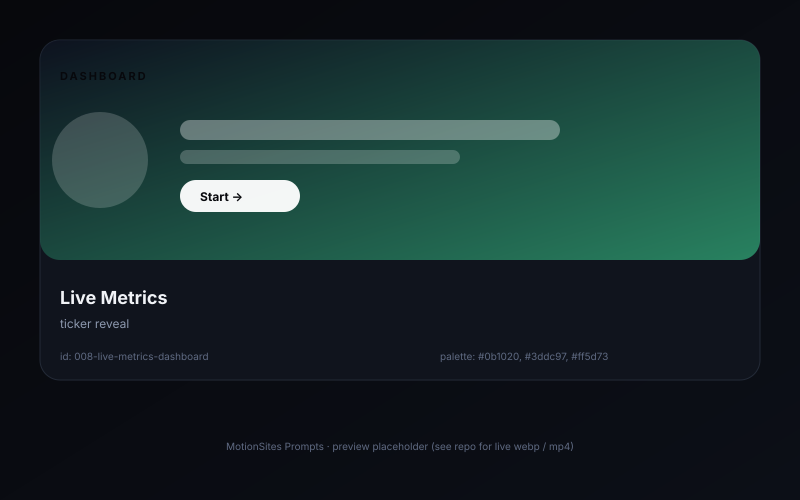

# Live metrics dashboard �� ticker reveal

> A four-up KPI row where each number rolls up from 0 on first paint, then keeps updating every 4s with a small flash animation.

## Preview



## Prompt

```text
Design a dashboard hero for "Pulse", a server-monitoring tool. Background: #0b1020. Top row: 4 KPI cards ("Active hosts", "P95 latency", "Error rate", "Cost / hr") arranged in a 4-column CSS grid. Each card is 220��140 with a 1px border rgba(255,255,255,.06), a 14px uppercase muted label, and a 36px JetBrains Mono bold number. On first paint, animate the number from 0 to its target with `requestAnimationFrame` over 900ms, easing cubic-bezier(.2,.7,.2,1). Every 4s, randomly tweak each number by ��3%, and on update briefly add a 200ms background flash (rgba(61,220,151,.12) for positive, rgba(255,93,115,.12) for negative). Below the KPI row, a single 600��220 area chart (SVG, no library) showing 24h of p95 latency, with a linear gradient fill (#3ddc97 �� transparent) and a 2px stroke. Use ResizeObserver to redraw the chart on container resize.
```

## Notes

- Avoid `setInterval` for ticker updates �� use `requestAnimationFrame` chained loops so updates pause when the tab is hidden.
- Numbers should always round to 2 decimal places to prevent jitter.

## Source

- Origin: curated from `Melectrona`
- License: MIT
