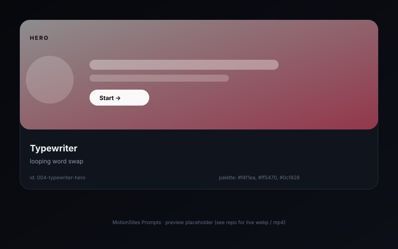

# Typewriter hero �� looping word swap

> Editorial-style hero where a single word inside a bold sentence is constantly retyped from a rotating list. Vanilla JS, no framework.

## Preview



## Prompt

```text
Design a two-line hero for a digital magazine. Background: warm off-white #f4f1ea. Line 1: "Stories about", set in Fraunces italic 56px, color #0c1828. Line 2: starts with the same Fraunces italic, but after a non-breaking space comes a span with a fixed width (e.g. 7ch) containing a rotating word: ["design", "code", "sound", "cities", "food"]. Animate the inner span with a vanilla JS loop: type one character every 65ms, hold for 1.4s, delete one character every 35ms, then advance the index. Use a blinking caret (border-right: 2px solid #ff5470, animated opacity 0/1 every 530ms). Below the headline, a 1-line sub-headline in 16px Inter 400 #0c1828 opacity .7, and a single pill button "Read the latest issue" with a sharp 1px #0c1828 border. No images.
```

## Notes

- Reserve width with `min-width: 7ch` so layout doesn't reflow while typing.
- Respect `prefers-reduced-motion: reduce` �� fall back to a static word.

## Source

- Origin: curated from `akkikumar72/liro-prompts`
- License: MIT
