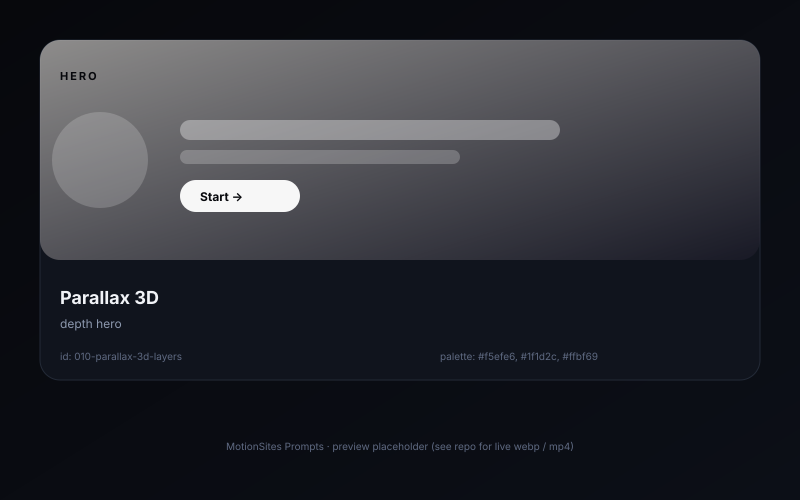

# Parallax 3D layers �� depth hero

> A hero with 4 stacked layers (background, mid, hero object, foreground particles) that translate at different speeds when the user moves the pointer or scrolls.

## Preview



## Prompt

```text
Build a one-screen hero for "Atlas �� map your ideas". Background: warm off-white #f5efe6. Stack 4 absolutely-positioned layers inside a 100vh container, each layer containing 1 SVG / PNG illustration. Layer 0 (background): soft radial gradient blob (#ffbf69 alpha .25, blur 60px). Layer 1 (mid): vector mountains, blurred 4px, translateY �� 12px on pointermove. Layer 2 (hero object): a stylized compass icon, translateX/Y �� 24px and rotateZ �� 4��. Layer 3 (foreground): 6 floating dots/particles, each with its own micro-animation (translateY ��6px loop) and a 200ms delay. Use `transform: translate3d(...)` on each layer; bind pointer position to a single `transform` reflow per `requestAnimationFrame`. On scroll past the hero, gently scale layer 2 down to 0.92 over 600ms.
```

## Notes

- A single `requestAnimationFrame` loop reading pointer state keeps this at 60fps even on mobile.
- Wrap each layer in `will-change: transform` to hint the compositor.

## Source

- Origin: curated from `akkikumar72/liro-prompts`
- License: MIT
