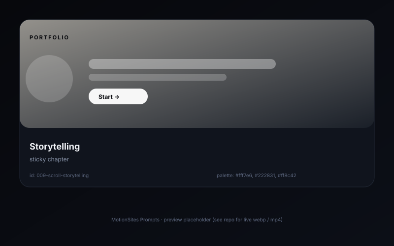

# Scroll storytelling — sticky chapter

> A long-scroll case-study page where a sticky chapter visualization on the left swaps as the reader scrolls through chapters on the right.

## Preview



## Prompt

```text
Design a case-study for "Aria — a music app redesign". Two-column layout — 1024px (40/60 split). Left column: a sticky container with a 16:10 mockup area where each chapter (Research, Ideation, Wireframes, Visual, Handoff) swaps in an illustration as the right-column chapter scrolls into view. Implement the swap with IntersectionObserver: when a `.chapter` element is `>= 50%` visible, add `.active` to the matching illustration, others fade to opacity .25 over 400ms. Right column: 5 stacked chapters, each ~80vh tall, with a 12px uppercase chapter number (#ff8c42), a 56px bold chapter title, 2—C3 paragraphs of body text (Inter 18px line-height 1.65), and 1—C2 inline images. Use a soft #fff7e6 page background and #222831 text. Add a thin scroll-progress bar at the top of the page (`<div class="progress">` whose `scaleX` is bound to scroll percentage).
```

## Notes

- Sticky inside `overflow: hidden` parents will not stick — make sure the outer layout is clean.
- Honor `prefers-reduced-motion` — fade illustrations instantly instead of cross-fading.

## Source

- Origin: curated from `xianxian-sensen`
- License: MIT
