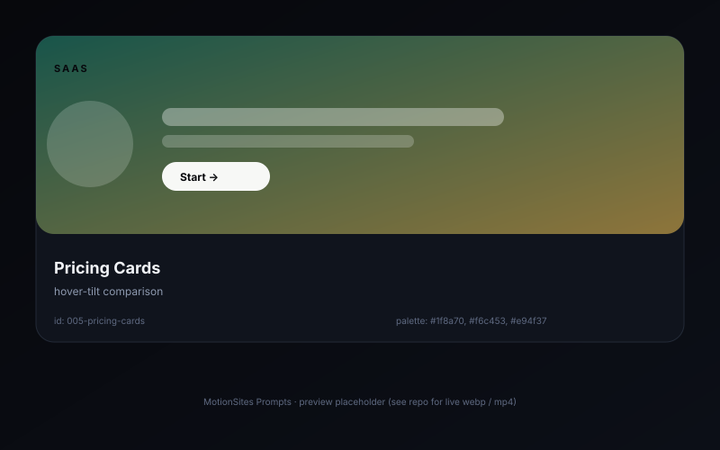

# Pricing cards ¡ª hover-tilt comparison

> Three pricing cards side-by-side. Hovering tilts the card 8¡ã toward the cursor, and the "Most popular" middle card gently pulses its border.

## Preview



## Prompt

```text
Build a "Pricing" section for a SaaS called "Quill". Three cards in a responsive grid (1fr / repeat(3, 1fr) ¡Ý 900px). Each card has: a soft 1px border (rgba(31,138,112,.18)), 24px corner radius, 32px padding, white background, a 24px semibold plan name ("Starter" / "Team" / "Enterprise"), a 48px bold price line ("$9 / mo"), a 12px muted billing note, a 96px divider, a 4-item feature list with custom green checkmarks (#1f8a70), and a 44px tall pill CTA. The middle card is "Most popular": add a 1.5px animated gradient border (linear-gradient(120deg, #1f8a70, #f6c453, #e94f37, #1f8a70) with background-size: 300% 300% and animation: borderShift 6s ease infinite). On hover, apply a 3D tilt (rotateX ¡À6¡ã, rotateY ¡À8¡ã, perspective 800px) using vanilla-tilt.js or CSS. Use Inter throughout. Keep contrast WCAG AA.
```

## Notes

- `vanilla-tilt.js` is 4 KB gzipped and works without dependencies.
- Disable tilt on touch with `pointer: coarse`.

## Source

- Origin: curated from `xianxian-sensen`
- License: MIT
