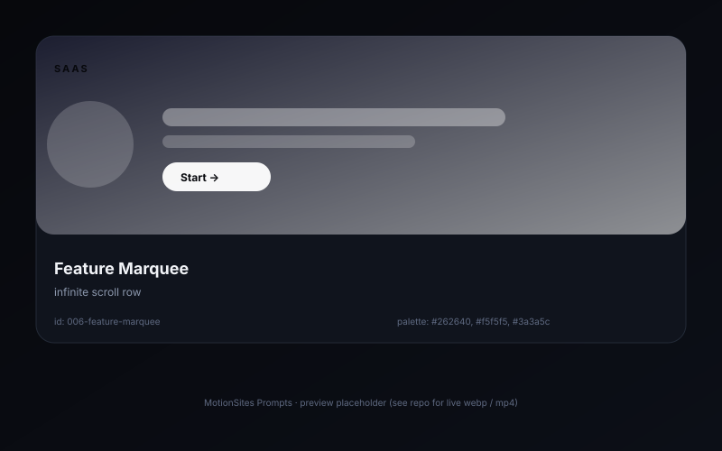

# Feature marquee — infinite scroll row

> A horizontally-scrolling strip of feature chips that loops seamlessly. Pure CSS, no JS.

## Preview



## Prompt

```text
Create a "Trusted by 12,000 teams" marquee section. A single row of 12 company logos / feature chips (rounded 32—32 dots with 1-line labels) on a #262640 background, scrolling right-to-left infinitely. Implementation: a flex container with the chip list duplicated twice side-by-side (one is the visible set, the other is the seamless tail). Apply `animation: marquee 28s linear infinite` to the inner track with `transform: translateX(0)` — `translateX(-50%)` (because the duplicate starts where the original ends). On hover, pause (`animation-play-state: paused`). Each chip is a 14px Inter 500 label inside a 28px-tall pill (background #f5f5f5 alpha .12, border 1px solid rgba(255,255,255,.08)). The whole strip sits inside a `mask-image: linear-gradient(90deg, transparent, black 12%, black 88%, transparent)` so the edges fade out.
```

## Notes

- The `translateX(-50%)` trick only works because the track contains exactly two copies.
- Test with `prefers-reduced-motion: reduce` — fall back to a static row.

## Source

- Origin: curated from `motionsites.ai`
- License: MIT
